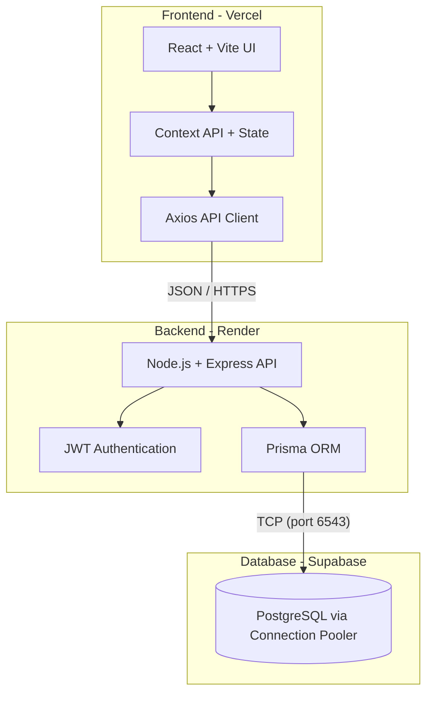
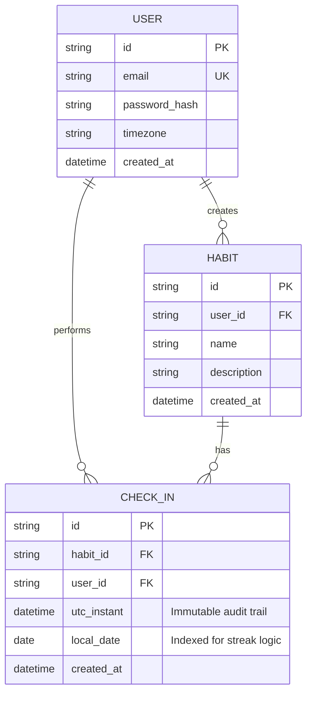
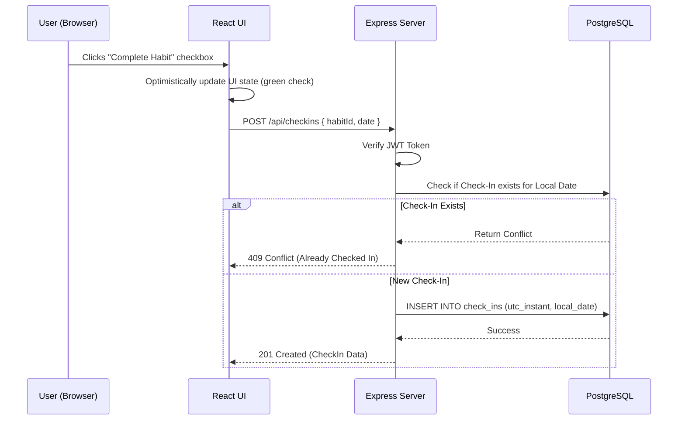

# HabitStreak Tracker 🚀


> A premium, beautifully designed SaaS application to track your habits, build unbreakable consistency, and visualize your daily progress.

**Live Demo (Frontend):** [https://habit-streak-tracker-kappa.vercel.app/](https://habit-streak-tracker-kappa.vercel.app/)

---

## 🎯 The Problem We Are Solving

Building good habits is fundamentally difficult because progress is invisible in the short term. People struggle with consistency because they lack a visual, rewarding system that holds them accountable and celebrates small wins. 

**HabitStreak solves this by providing:**
1. **Visual Accountability:** A beautiful GitHub-style contribution heatmap and progress rings that make your consistency visual.
2. **Frictionless Tracking:** An ultra-fast, real-time dashboard where logging a habit takes less than a second.
3. **Timezone Accuracy:** True UTC database storage with local-time resolution, ensuring your streaks never incorrectly break when you travel.

---

## 🏗️ High-Level Architecture

HabitStreak is built using a modern, decoupled full-stack architecture. 



### Tech Stack
- **Frontend:** React.js, Vite, Vanilla CSS (Glassmorphism UI)
- **Backend:** Node.js, Express.js
- **Database:** PostgreSQL (Supabase)
- **ORM:** Prisma
- **Authentication:** JSON Web Tokens (JWT) & bcrypt

---

## 🗄️ Entity-Relationship (ER) Diagram

The database is normalized and designed for fast, time-series querying of habit check-ins.



---

## 🔄 Data Flow Diagram (DFD)

This diagram illustrates how data flows when a user marks a habit as "complete" for the day.



---

## 🚀 Local Development Setup

Want to run HabitStreak locally? Follow these steps:

### 1. Clone the repository
```bash
git clone https://github.com/WPrasad99/habit-streak-tracker.git
cd habit-streak-tracker
```

### 2. Setup the Backend
```bash
cd backend
npm install
```
- Create a `.env` file in the `backend` folder:
  ```env
  DATABASE_URL="postgresql://postgres:[PASSWORD]@[POOLER-HOST]:6543/postgres?pgbouncer=true"
  JWT_SECRET="your-secret-key"
  PORT=3000
  ```
- Push the database schema:
  ```bash
  npx prisma db push
  ```
- Start the server:
  ```bash
  npm start
  ```

### 3. Setup the Frontend
```bash
cd ../frontend
npm install
```
- Create a `.env.local` file in the `frontend` folder:
  ```env
  VITE_API_URL="http://localhost:3000/api"
  ```
- Start the development server:
  ```bash
  npm run dev
  ```

Visit `http://localhost:5173` to view the app!

---
*Built with ❤️ for building better habits.*
